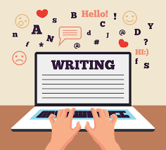

# DIGHUM101 Summer 2023 Individual Project
  
### Topic: The writing ability of AI
#### "Can AI write like a Human?"
### </n> 
Audrey Choi </n>
---
### Table of Contents
- Introduction
- Research questions
- Materials/Methods and Results
 0) Import Tools and Implement Helper Functions
  1) Evaluate translation ability I (simple informative text)
     - Data Cleaning
     - Data Visualization
     - Results and Analysis
  2) Evaluate translation ability II (complicated lyrics text)
     - Data Cleaning
     - Data Visualization
     - Results and Analysis
  3) Evaluate creative writing ability I (informative news article text)
     - Data Cleaning
     - Data Visualization
     - Results and Analysis
  4) Evaluate creative writing ability II (emotional letter text)
      - Data Cleaning
      - Data Visualization
      - Results and Analysis
- Conclusion
---
### Abstract of the project
The rapid progress of artificial intelligence (AI) in natural language generation has brought about a paradigm shift in the field of Digital Humanities. AI models like ChatGPT demonstrate remarkable proficiency in generating coherent and contextually fitting text, leveraging extensive training data to capture patterns, grammar, and nuances of human language. This project delves into the capabilities of AI in written communication within the realm of Digital Humanities, emphasizing responsible deployment, societal impacts, and insights into language and creativity. By comparing AI-generated text with human-authored content, we assess the proficiency of AI while identifying resemblances and distinctions. Furthermore, we explore the challenges AI faces in replicating emotional expression, acknowledging its limitations in capturing the subtle nuances of human emotions. The project contributes to optimizing AI utilization in Digital Humanities, establishing ethical guidelines, adapting to evolving job markets, and deepening our understanding of language and communication in this interdisciplinary domain. As AI's potential in written communication expands, this research sheds light on AI's capabilities, their implications for Digital Humanities, and avenues for enhancing emotional AI in this context.
